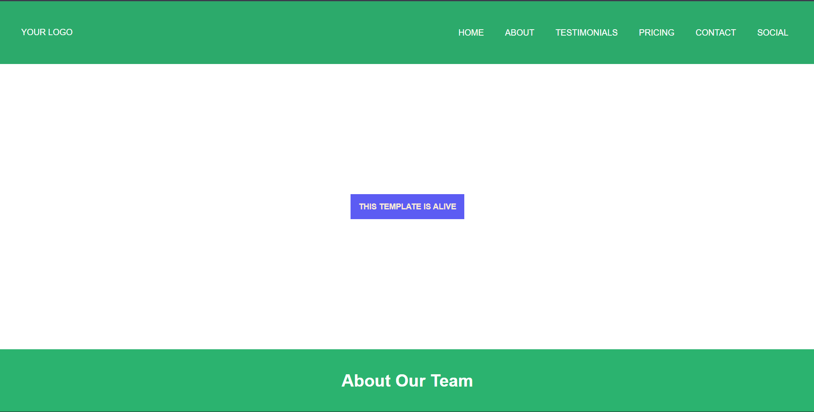
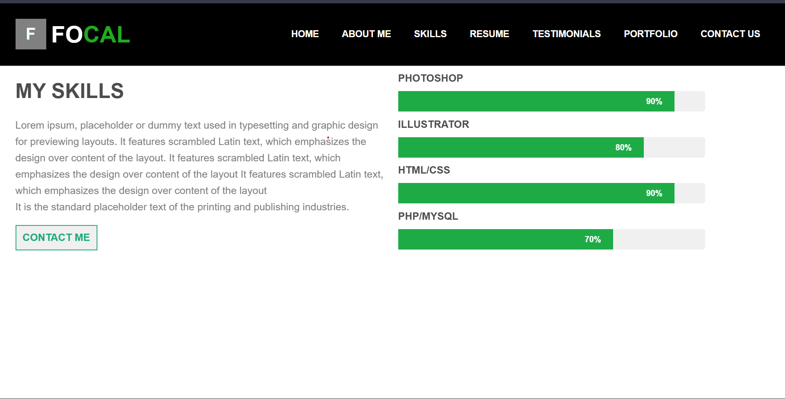
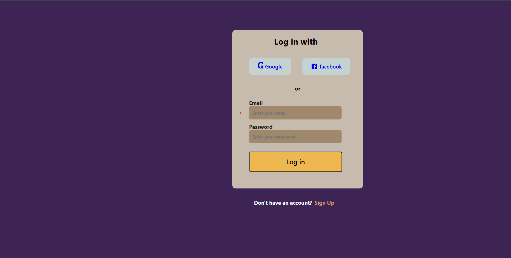

# 🌐 Web Page Layout Customisation Practice

## 📌 Project Overview

This project is a collection of web page layout designs created to practice and improve frontend development skills. It focuses on building visually appealing and responsive layouts using modern CSS techniques.

The goal of this project is to understand how different layout structures work and how to customize them effectively for real-world applications.

---

## 🚀 Features

* 🎨 Multiple layout designs and variation
* 🧱 Flexbox and Grid-based layouts
* 🎯 Clean alignment, spacing, and structure
* 💡 UI-focused recreating design practice

---

## 🛠️ Tech Stack

* HTML5
* CSS3
* Flexbox
* CSS Grid

---

## 🖼️ Output Screenshots

---

## 🎯 What I Learned

* Creating structured layouts using Flexbox and Grid
* Improving UI alignment and spacing
* Enhancing visual hierarchy and readability

---

## 🙌 Acknowledgment

This project was built as part of frontend design re-creation practice to strengthen layout design and UI development skills.

---
